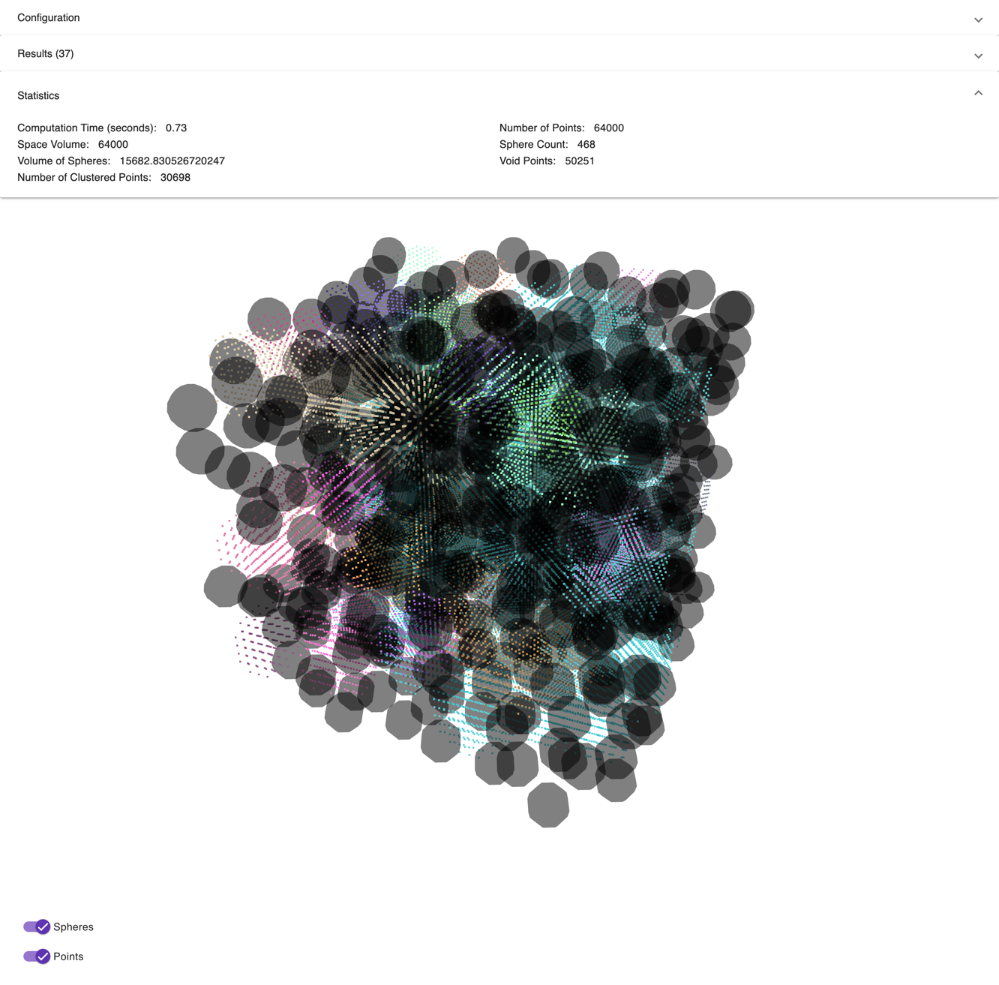

# Free-Space

**Free-Space** is an web application that simulates and visualizes 3d *“free space”* by randomly packing non-overlapping spheres inside a bounded box and then clustering the remaining (void) space using a DBSCAN-like approach. The results are rendered with **three.js**, allowing interactive exploration of point clusters in 3d via orbit controls.

---

##  Features

- Generate non-overlapping spheres of a given radius inside a 3D box.  
- Build a regular 3D grid of sample points within the box.  
- Remove points that fall inside any sphere (leaving **void points**).  
- Detect **core points** among void points (DBSCAN core detection with octree neighbor search) in parallel **Web Workers**.  
- Expand clusters on the main worker and stream results to the Angular UI.  
- Visualize clusters as colored **point clouds**, with optional sphere rendering.  

---

##  Tech Stack & Key Dependencies

- **Frontend Framework**: `@angular/* v18`  
- **Rendering**: `three (0.125.0)` + `three-orbitcontrols`  
- **Spatial Indexing**: `d3-octree`  
- **Functional Helpers**: `ramda`  
- **Concurrency**: Web Workers (multi-worker setup, dynamically split via `navigator.hardwareConcurrency`)  
- **Reactive Streams**: `RxJS` (for streaming worker results to UI)  

---

##  Preview

